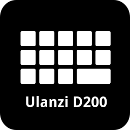

<div align="center">
    
</div>

# OpenDeck Ulanzi D200 Driver (Unofficial)

An unofficial plugin for [OpenDeck](https://github.com/nekename/OpenDeck) that adds support for the Ulanzi D200 and D200H devices.

> **Note**: This project is mirrored on GitHub for visibility, but the official source is on [GitLab](https://gitlab.com/glmagalhaes.mail/rs-ulanzi-d-200-linux). Please open issues there.
>
> **Recommendation:** For best compatibility, update your device firmware using the official **Ulanzi Studio** (available for macOS and Windows).

---

## Supported Devices

- Ulanzi D200 (USB ID `2207:0019`)
- Ulanzi D200H (USB ID `2207:0019`)

The D200H is identical to the D200 but includes two additional USB hubs (Genesys Logic, Inc., `05e3:0610`).

---

## Platform Support

| Platform | Status |
|----------|--------|
| Linux    | ✅ Supported (actively developed and tested) |
| Windows  | ❌ Planned (see roadmap) |
| macOS    | ❌ Planned (see roadmap) |

If you would like to help port the plugin to another platform, feel free to contribute!

---

## Installation

1. Download the latest file from the [releases page](https://gitlab.com/glmagalhaes.mail/rs-ulanzi-d-200-linux/-/releases).
2. In OpenDeck, go to **Plugins → Install from file** and select the archive.
3. The plugin will appear in your plugin list.

> The plugin is also available via the OpenDeck's [OpenAction Marketplace](https://marketplace.tacto.live/plugin/com.glmagalhaes.ulanzi.d200).

---

## Actions

### Screen Switch

Cycles the built‑in status display of the wide button through three modes:

- **Blank** – it will show empty or the icon of your choice
- **Clock** – show current time
- **PC stats** – displays CPU, RAM, and GPU load

This action does **not** affect the button’s ability to send key presses. It only changes the visual information shown on the device’s screen.

---

## Building from Source

Requirements: Rust, Cargo, and standard build tools (e.g., `git`, `make`).

The repository includes a `pack.sh` script that compiles the plugin and packages it as a `.zip` file.

```sh
# Debug build (output in target/debug/)
sh pack.sh

# Release build (optimized, output in target/release/)
sh pack.sh release
```

> **Note**: The script assumes a typical Rust environment. If you encounter issues, ensure cargo is in your $PATH.

---

## Known issues

### Stretched Icon on Wide button

OpenDeck currently only supports a grid of square buttons (e.g., 5×3). The Ulanzi D200 has a wide button that spans two columns. Because OpenDeck treats every cell as an independent square, the icon assigned to that button appears stretched horizontally.

### Extra empty button

Since OpenDeck’s grid is always rectangular, the plugin must define a fixed number of rows and columns. On the D200, this creates a “ghost” button in the bottom‑right position (row 3, column 5) that does not exist on the physical device. This button is non‑functional and can be ignored, or you can just store an spare action there ¯\\_(ツ)_/¯.


### Wide button not working

If the wide button does not register key presses correctly, the device firmware might be outdated.
Update the firmware using **Ulanzi Studio** (available for macOS and Windows) – this is the only official method provided by Ulanzi. After updating, the button should function correctly with the plugin.

---

## Road Map

The road map is really short because the plug-in is already working without any problems and all the main features are already done

### v1.0.0
- [ ] Community testing phase completed
- [ ] Better icon for the Screen Switch action
- [x] Saving status window state from previous sessions #14 (Implemented on 0.6.5)
- [ ] Stability updates

### Future (help wanted)
- [ ] Support for macOS
- [ ] Support for Windows

## Contributing

Contributions are welcome! Please:

- Use the [GitLab](https://gitlab.com/glmagalhaes.mail/rs-ulanzi-d-200-linux) repository (the GitHub mirror is read‑only).
- Open an issue first to discuss major changes.

## License
This project is licensed under the GNU Affero General Public License v3.0 – see the LICENSE file for details.